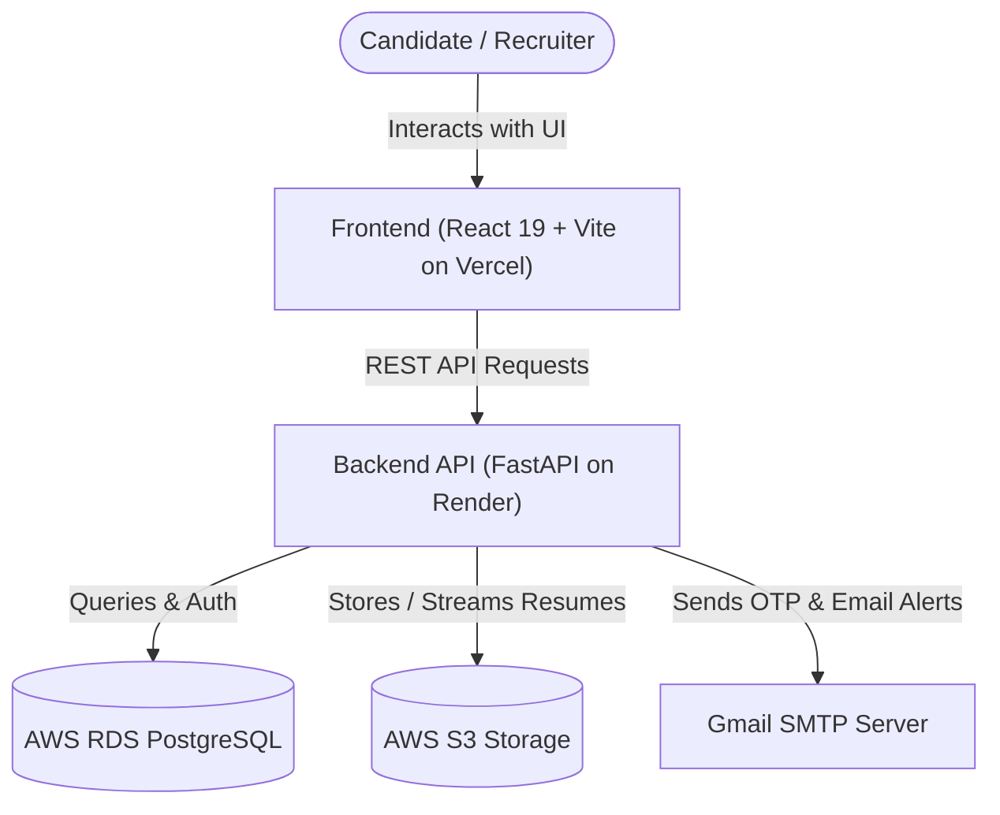

# SmartSkale Candidate Sourcing System

A production-grade, full-stack recruitment and candidate sourcing platform built with **FastAPI**, **React 19**, **PostgreSQL / AWS RDS**, **AWS S3**, and **Gmail SMTP**.

---

## 🚀 Live Deployments

- **Frontend (Vercel):** [https://your-frontend.vercel.app](https://smart-scale-candidate-sourcing-syst.vercel.app/jobs) *(To be updated after deployment)*
- **Backend API (Render):** [https://your-backend.onrender.com](https://smartscale-candidate-sourcing-system.onrender.com/docs) *(To be updated after deployment)*
- **Interactive API Docs (Swagger):** [https://your-backend.onrender.com/docs](https://smartscale-candidate-sourcing-system.onrender.com/docs)

---

## 🛠️ Tech Stack

### Frontend
- **Framework:** React 19 + TypeScript + Vite
- **Styling:** Tailwind CSS + Lucide Icons
- **State Management & Data Fetching:** TanStack React Query + Axios
- **Form Handling & Validation:** React Hook Form + Zod
- **Notifications:** React Hot Toast

### Backend
- **Framework:** FastAPI (Python 3.11+)
- **ORM & Database Driver:** SQLAlchemy 2.0 (AsyncIO) + Asyncpg
- **Database Migrations:** Alembic
- **Authentication & Security:** JWT (Access & Refresh tokens) + Passlib/Bcrypt + HMAC-SHA256 OTP
- **Email Service:** Python SMTPLib (Gmail SMTP with TLS)
- **Testing:** Pytest (84 unit and integration test suite)

### Cloud Infrastructure
- **Relational Database:** AWS RDS PostgreSQL (Engine: PostgreSQL 18.6 ARM64)
- **Object Storage:** AWS S3 (Bucket: `smartscalebucket` in `eu-north-1`)
- **Hosting:** Render (Web Service) + Vercel (Edge Network Static Site)

---

## ✨ Key Features

### 1. Candidate Application & Portal
- **Email OTP Verification:** Mandatory 6-digit OTP verification with 5-minute expiry and brute-force protection before account registration.
- **Structured Application Flow:** Bio-data, multi-institution education details, work experience snapshots, and cover notes.
- **Resume Upload & Storage:** Support for PDF, DOC, and DOCX resumes up to 5 MB stored securely in **AWS S3**.
- **Application Tracking:** Real-time visibility into application status (`NEW`, `REVIEWED`, `SHORTLISTED`, `REJECTED`, `HIRED`).

### 2. Administrator & Recruiter Console
- **Requisition Management:** Create, edit, duplicate, publish, and close job postings.
- **Timeline & Application End Date:** Manual deadline setting with automatic requisition closure when expired.
- **Candidate Evaluation Grid:** Filter, search by name/skills, and sort candidates across all requisitions.
- **In-Page Resume Viewer:** Direct embedded PDF preview iframe without requiring local file downloads, plus download actions.
- **CSV Data Export:** Export consolidated applicant records for offline analysis.
- **Status Workflow Updates:** Transition candidate statuses with automated email alerts.

### 3. Automated Transactional Notifications
- **OTP Verification Emails:** Secure registration verification codes sent via Gmail SMTP.
- **Application Confirmation:** Instant confirmation receipts with tracking links sent to candidates.
- **Admin Alerts:** Immediate notification to recruiters when new candidates apply.
- **Status Change Updates:** Automated email notifications sent to candidates upon stage progression.

---

## 📐 System Architecture



---

## 📁 Repository Structure

```text
├── backend/
│   ├── alembic/                # Database migrations
│   ├── app/
│   │   ├── api/v1/             # API route endpoints
│   │   ├── core/               # Configuration, security, dependencies
│   │   ├── db/                 # Session management & seeding
│   │   ├── models/             # SQLAlchemy ORM database models
│   │   ├── schemas/            # Pydantic request/response schemas
│   │   └── services/           # Business logic (Auth, Jobs, Applications, S3, Email)
│   ├── tests/                  # Pytest automated test suite (84 tests)
│   ├── requirements.txt        # Python backend dependencies
│   ├── render.yaml             # Render deployment blueprint
│   └── start.sh                # Render startup script
│
├── frontend/
│   ├── src/
│   │   ├── api/                # Axios instance & API client functions
│   │   ├── components/         # Reusable UI components
│   │   ├── features/           # Feature pages (Admin, Candidate, Auth, Jobs)
│   │   ├── layouts/            # Page layouts
│   │   └── types/              # TypeScript type definitions
│   ├── package.json            # Node.js dependencies
│   ├── vite.config.ts          # Vite configuration
│   └── vercel.json             # Vercel SPA routing configuration
│
├── .gitignore                  # Git ignore rules protecting secrets (.env)
└── README.md                   # Project documentation
```

---

## ⚙️ Environment Configuration

### Backend (`backend/.env`)

Create a `.env` file in the `backend/` directory based on `backend/.env.example`:

```env
# Database (AWS RDS PostgreSQL)
DATABASE_URL=postgresql+asyncpg://<username>:<password>@<rds-endpoint>:5432/<dbname>

# Storage (AWS S3)
STORAGE_BACKEND=s3
AWS_ACCESS_KEY_ID=<your-aws-access-key-id>
AWS_SECRET_ACCESS_KEY=<your-aws-secret-access-key>
AWS_REGION=eu-north-1
AWS_S3_BUCKET_NAME=smartscalebucket

# Security (JWT)
JWT_SECRET_KEY=<your-secure-32-char-secret-key>
JWT_ALGORITHM=HS256

# Gmail SMTP
EMAIL_BACKEND=smtp
SMTP_HOST=smtp.gmail.com
SMTP_PORT=587
SMTP_USER=<your-email@gmail.com>
SMTP_PASSWORD=<your-gmail-app-password>
SMTP_FROM_EMAIL=<your-email@gmail.com>
SMTP_USE_TLS=true

# URLs & CORS
FRONTEND_URL=http://localhost:5173
CORS_ORIGINS=["http://localhost:5173","http://localhost:3000"]
SEED_ADMIN_EMAIL=hasibshaikh583@gmail.com
SEED_ADMIN_PASSWORD=Admin@12345
```

### Frontend (`frontend/.env`)

```env
VITE_API_URL=http://127.0.0.1:8000/api/v1
```

---

## 💻 Local Development Setup

### Prerequisites
- Python 3.11+
- Node.js 18+ and npm
- PostgreSQL (or connection to AWS RDS)

### 1. Backend Setup
```bash
cd backend
python -m venv .venv
source .venv/bin/activate   # On Windows: .venv\Scripts\activate
pip install -r requirements.txt

# Run migrations & seed database
alembic upgrade head
python -m app.db.seed

# Start backend server
uvicorn app.main:create_app --factory --reload --port 8000
```

### 2. Frontend Setup
```bash
cd frontend
npm install
npm run dev
```
Open [http://localhost:5173](http://localhost:5173) in your browser.

### 3. Running Automated Tests
```bash
cd backend
pytest -v
```

---

## 🚢 Deployment Guide

### Deploying Backend on Render
1. Create a new **Web Service** on [Render](https://render.com) pointing to the `backend` directory.
2. Build Command: `pip install -r requirements.txt`
3. Start Command:
   ```bash
   alembic upgrade head && python -m app.db.seed && uvicorn app.main:create_app --factory --host 0.0.0.0 --port $PORT
   ```
4. Configure all environment variables from `backend/.env.example` in the Render dashboard.

### Deploying Frontend on Vercel
1. Import repository on [Vercel](https://vercel.com).
2. Set Framework to **Vite** and Root Directory to `frontend`.
3. Add Environment Variable:
   - `VITE_API_URL`: `https://<your-render-backend-url>/api/v1`
4. Click **Deploy**.

---

## 🔒 Security & Privacy Notice
- `.gitignore` is configured to prevent committing `.env` files, credentials, or secrets to version control.
- Passwords are encrypted with **Bcrypt**.
- Session authentication utilizes signed **JWT** tokens.
- OTP verification codes are validated using **HMAC-SHA256** signatures.
- AWS S3 access credentials use least-privilege IAM policies.
